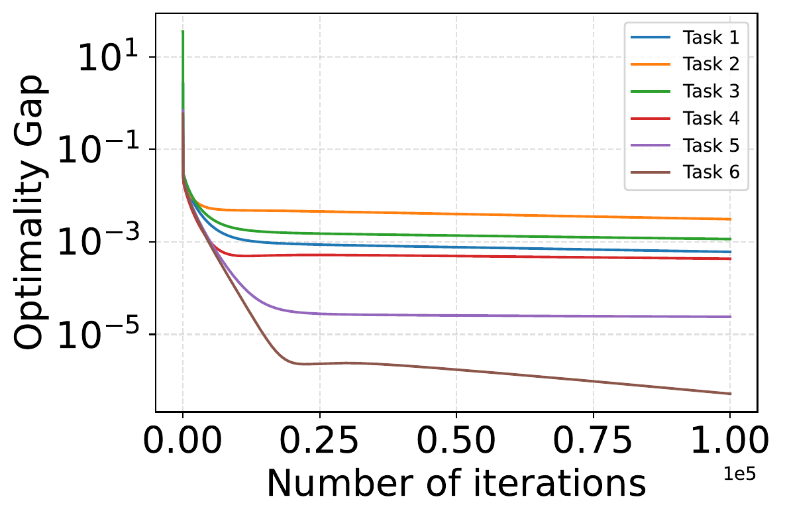
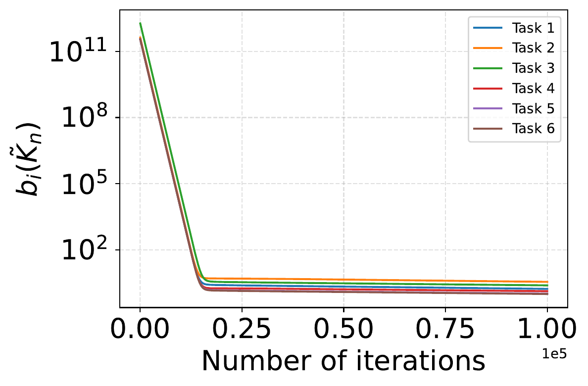
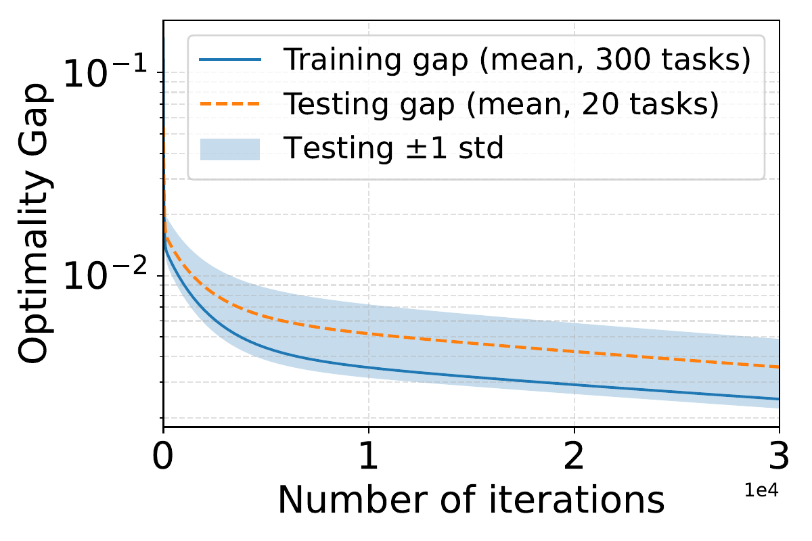
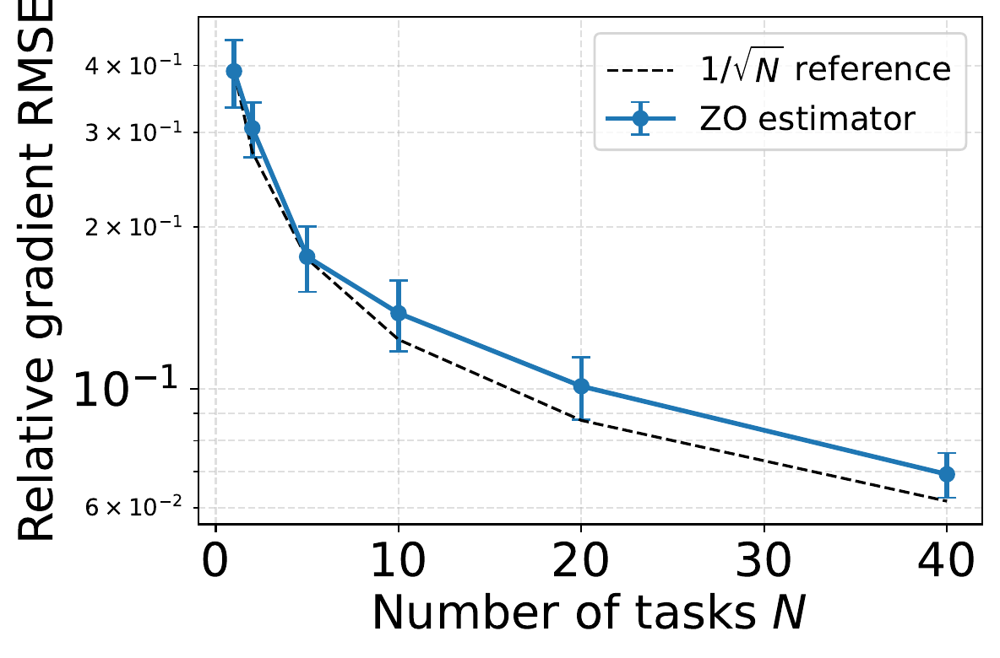

# Multitask LQG Control: Performance and Generalization Bounds

This repository contains the code to reproduce the experimental results from the following paper:

**Leonardo F. Toso\*, Kasra Fallah\*, Charis Stamouli\*, George J. Pappas, and James Anderson.**  
\*Equal contribution.

[Multitask LQG Control: Performance and Generalization Bounds](#)

## Overview

This work studies **multitask learning for stochastic and partially observed control systems**, with a focus on the **Linear Quadratic Gaussian (LQG)** problem.

Our goal is to learn a **single stabilizing controller** that performs well across a distribution of related LQG tasks, where each task may differ in its dynamics, observation model, noise statistics, and cost matrices. Unlike prior multitask learning results for LQR, which assume deterministic and fully observed systems, this work addresses the significantly harder **partially observed and noisy** setting.

To make this possible, we leverage a **history-dependent lifting** that recasts each LQG task as an equivalent high-dimensional LQR problem in the space of input-output histories. This representation allows us to analyze policy gradient methods in the multitask LQG setting and derive explicit performance and generalization guarantees.

A central challenge in multitask control is **task heterogeneity**: even when each task is individually well behaved, differences in system and cost parameters prevent a single controller from being simultaneously optimal for all tasks. In this work, we characterize this effect through a **bisimulation-based heterogeneity measure**, which quantifies the mismatch between task-specific gradient dynamics in the lifted space.

In addition to performance guarantees, the paper provides a **generalization bound** for unseen tasks and shows that, in the **model-free setting**, aggregating data across tasks reduces the variance of one-point zeroth-order policy gradient estimators proportionally to the number of training tasks.

## Main Contributions

- We establish **policy gradient performance bounds for multitask LQG** by leveraging a history-dependent lifting that transforms the partially observed problem into an equivalent high-dimensional multitask LQR problem.
- We introduce a **bisimulation-based characterization of task heterogeneity** tailored to the LQG setting, capturing discrepancies in both control and estimation dynamics.
- We derive **generalization bounds** that explicitly quantify how heterogeneity impacts transfer to unseen tasks.
- In the **model-free setting**, we show that multitask learning reduces gradient estimation variance proportionally to the number of training tasks, while still exhibiting a heterogeneity-dependent bias term.

## Supported Systems

The current code supports three dynamical system families:

- `cartpole` — 4-state partially observed cart-pole
- `pendulum` — 2-state partially observed inverted pendulum
- `synthetic` — 4-state synthetic LTI benchmark

These options can be selected directly inside the experiment scripts.

## Experiments

The repository includes standalone scripts for reproducing the main numerical results in the paper:

1. **Model-based multitask training**  
   Trains a shared lifted controller and evaluates the task-specific optimality gaps together with the bisimulation-based heterogeneity measures.

2. **Generalization to unseen tasks**  
   Trains a shared lifted controller on a collection of tasks and evaluates its performance on held-out tasks drawn from the same task distribution.

3. **Variance reduction in the model-free setting**  
   Evaluates the multitask one-point zeroth-order gradient estimator and shows that the relative gradient RMSE decreases as the number of tasks increases. The script also supports an optional OOD experiment.

The figures below illustrate the main phenomena studied in the paper.

<div align="center">

<table>
  <tr>
    <td align="center" width="50%">
      <br>
      <sub><b>(a) Task-specific optimality gaps</b> — the shared lifted controller improves performance across training tasks, with residual error depending on task heterogeneity.</sub>
    </td>
    <td align="center" width="50%">
      <br>
      <sub><b>(b) Bisimulation-based heterogeneity</b> — the heterogeneity measures decrease during training, reflecting improved alignment of task-specific gradients.</sub>
    </td>
  </tr>
  <tr>
    <td align="center" width="50%">
      <br>
      <sub><b>(c) Generalization to unseen tasks</b> — the learned shared controller transfers to held-out systems drawn from the same task distribution.</sub>
    </td>
    <td align="center" width="50%">
      <br>
      <sub><b>(d) Variance reduction in the model-free setting</b> — multitask aggregation improves sample efficiency by reducing gradient estimation variance as the number of tasks increases.</sub>
    </td>
  </tr>
</table>

</div>

## Repository Structure

The main files are:

* `pg_lqg_multitask_model_based.py`
  Main model-based multitask LQG training script. Produces the optimality-gap and bisimulation plots and can also save run data.

* `pg_lqg_generalization_demo.py`
  Generalization experiment on held-out tasks.

* `pg_lqg_variance_reduction_demo.py`
  Model-free variance-reduction experiment for the multitask zeroth-order gradient estimator.

The generalization and variance-reduction scripts are written to import the shared LQG utilities either from `pg_lqg_multitask_model_based.py` this files should remain in the same folder.

## Requirements

The code is written in Python and uses the standard scientific computing stack.

### Core dependencies

- `numpy`
- `matplotlib`
- `scipy`

### Optional dependency

- `cvxpy`

If `cvxpy` is available, the code can solve the bisimulation-related SDP using installed conic solvers such as `MOSEK`, `CLARABEL`, `CVXOPT`, or `SCS`. If `cvxpy` is not installed, the scripts will still run, but SDP-based bisimulation functionality may be unavailable.

You can install the main dependencies with:

```bash
pip install numpy matplotlib scipy cvxpy
```

## Troubleshooting

If you have any trouble running the code or questions about the paper, please contact:

**Kasra Fallah**  
[kasra.fallah@columbia.edu](mailto:kasra.fallah@columbia.edu)

## Citation

If you use this code or build upon this work, please cite:

> **Leonardo F. Toso\*, Kasra Fallah\*, Charis Stamouli\*, George J. Pappas, and James Anderson.**  
> *Multitask LQG Control: Performance and Generalization Bounds.*  
> 2026.  
> \*Equal contribution.

You may use the following BibTeX entry:

```bibtex
@article{toso2026multitasklqg,
  title   = {Multitask LQG Control: Performance and Generalization Bounds},
  author  = {Toso, Leonardo F. and Fallah, Kasra and Stamouli, Charis and Pappas, George J. and Anderson, James},
  year    = {2026},
  note    = {*Equal contribution by the first three authors}
}
